# HemoNexus - Core Workflows

## Overview

This document describes the core workflows in HemoNexus, including blood requirement workflow, donor-first escalation, donor registration, donor verification, donor mobilization, platelet lifecycle, platelet expiry, blood request workflow, platelet request workflow, inter-hospital coordination, reservation, transfer, receipt, and audit.

**Development Status:** Module 0 - Project Specification & Development Rules (PLANNED)

---

## Blood Requirement Workflow

### Donor-First Escalation Principle

The primary blood requirement workflow follows a donor-first escalation approach:

```
LOCAL INVENTORY
        ↓
DONOR MOBILIZATION
        ↓
INTER-HOSPITAL COORDINATION
        ↓
ONLY WHEN STILL INSUFFICIENT
```

### Detailed Blood Requirement Workflow

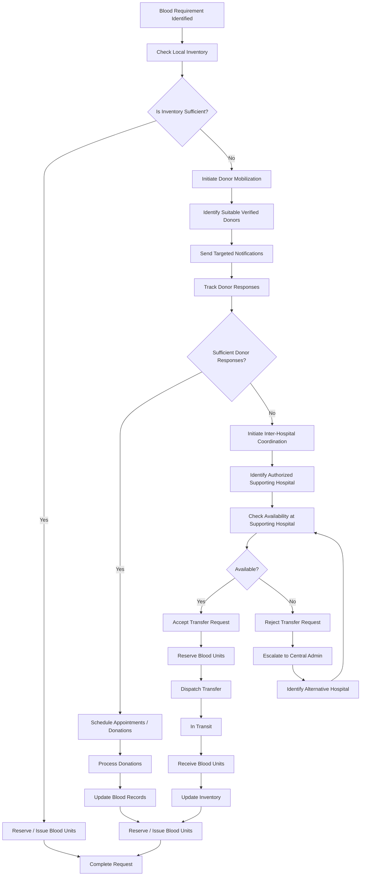

### Workflow Steps

#### Step 1: Check Local Inventory
- Blood Bank Staff identifies blood requirement
- System checks local blood inventory
- Inventory is filtered by blood type, Rh factor, and component
- Available units are identified

#### Step 2: Reserve/Issue (if sufficient)
- If local inventory is sufficient, blood units are reserved
- Blood units are issued to the requesting department
- Request is marked as complete
- Inventory is updated

#### Step 3: Donor Mobilization (if insufficient)
- If local inventory is insufficient, donor mobilization is initiated
- System identifies suitable verified donors based on:
  - Blood type compatibility
  - Rh factor compatibility
  - Geographic proximity
  - Availability preferences
- Targeted notifications are sent to identified donors

#### Step 4: Donor Response Tracking
- System tracks donor responses to mobilization requests
- Donors can accept or decline requests through donor portal
- Appointment scheduling is managed for accepting donors

#### Step 5: Donation Processing
- Donors complete donations at scheduled appointments
- Blood units are registered in the system
- Blood units are processed and made available
- Inventory is updated

#### Step 6: Inter-Hospital Coordination (if still insufficient)
- If donor mobilization does not yield sufficient blood units, inter-hospital coordination is initiated
- System identifies authorized supporting hospitals within the institution
- Availability is checked at supporting hospitals

#### Step 7: Transfer Request
- Transfer request is sent to supporting hospital
- Supporting hospital evaluates request
- Supporting hospital accepts or rejects request

#### Step 8: Transfer Execution
- If accepted, blood units are reserved at supporting hospital
- Blood units are dispatched
- Transfer status is tracked (dispatched, in transit, received)
- Receiving hospital confirms receipt
- Inventory is updated at both hospitals

#### Step 9: Escalation (if no availability)
- If no supporting hospital has availability, request is escalated to Central Admin
- Central Admin identifies alternative hospitals or solutions
- Process continues until requirement is fulfilled

---

## Donor Registration Workflow

### Donor Self-Registration

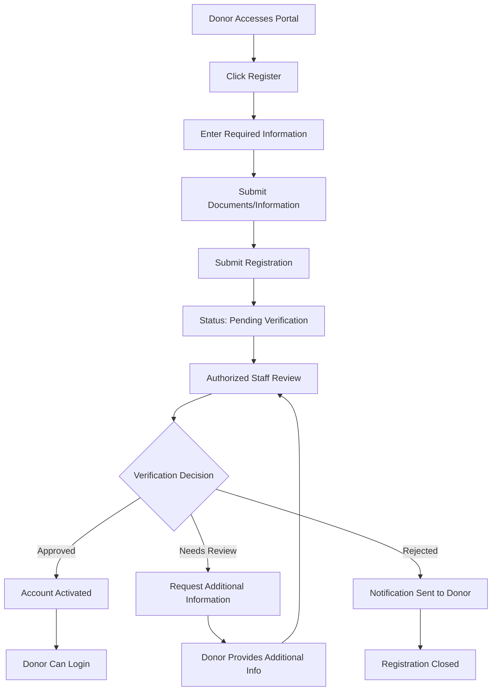

### Hospital-Assisted Registration

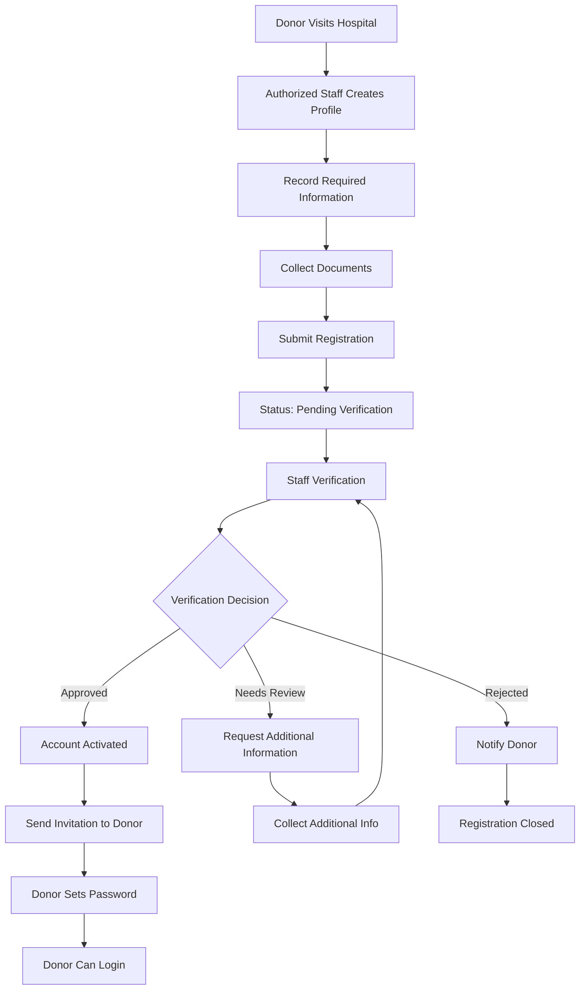

### Workflow Steps

#### Self-Registration Steps
1. Donor accesses donor portal
2. Donor clicks register button
3. Donor enters required information:
   - Personal details (name, date of birth, contact information)
   - Medical information (blood type if known)
   - Address information
4. Donor submits required documents/information:
   - Identification documents
   - Medical history (if applicable)
5. Registration is submitted
6. Status is set to "Pending Verification"
7. Authorized staff reviews registration
8. Staff makes verification decision:
   - Approved: Account is activated
   - Needs Review: Additional information is requested
   - Rejected: Registration is closed

#### Hospital-Assisted Registration Steps
1. Donor visits hospital
2. Authorized staff creates donor profile
3. Staff records required information
4. Staff collects documents
5. Staff submits registration
6. Status is set to "Pending Verification"
7. Staff performs verification
8. Staff makes verification decision:
   - Approved: Account is activated, invitation sent to donor
   - Needs Review: Additional information is collected
   - Rejected: Donor is notified, registration is closed

---

## Donor Verification Workflow

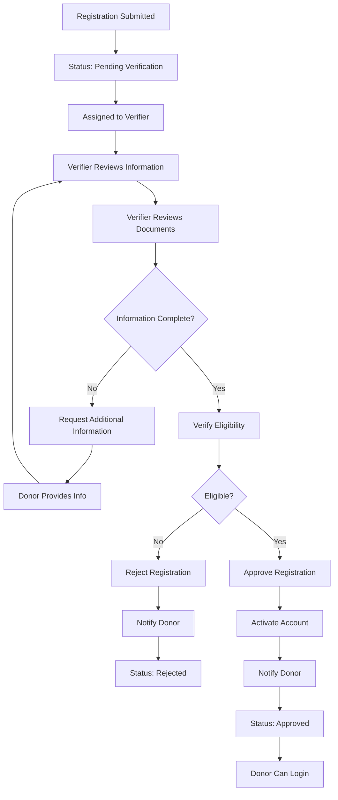

### Verification Steps

1. Registration is submitted
2. Status is set to "Pending Verification"
3. Registration is assigned to a verifier
4. Verifier reviews donor information
5. Verifier reviews submitted documents
6. Verifier checks if information is complete
7. If incomplete, additional information is requested
8. Once complete, verifier verifies eligibility
9. Verifier makes eligibility decision:
   - Not eligible: Registration is rejected, donor is notified
   - Eligible: Registration is approved, account is activated
10. Donor is notified of decision
11. Status is updated accordingly

---

## Donor Mobilization Workflow

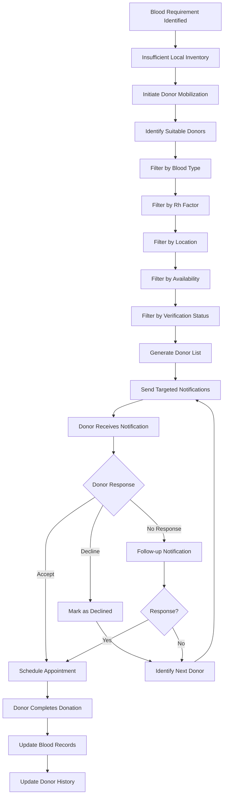

### Mobilization Steps

1. Blood requirement is identified
2. Local inventory is insufficient
3. Donor mobilization is initiated
4. System identifies suitable donors by filtering:
   - Blood type compatibility
   - Rh factor compatibility
   - Geographic proximity
   - Availability preferences
   - Verification status (must be verified)
5. Targeted notifications are sent to identified donors
6. Donors receive notifications through donor portal
7. Donors respond:
   - Accept: Appointment is scheduled
   - Decline: Next donor is identified
   - No response: Follow-up notification is sent
8. Donors complete donations at scheduled appointments
9. Blood records are updated
10. Donor history is updated

---

## Platelet Lifecycle Workflow

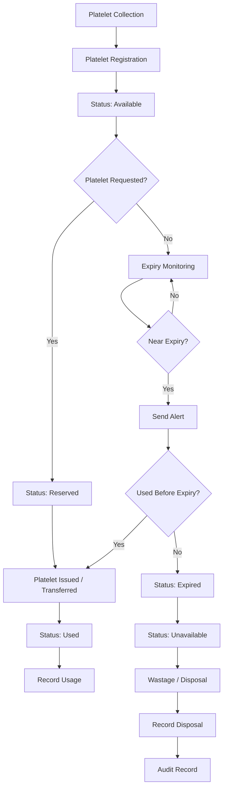

### Lifecycle Steps

#### Collection to Registration
1. Platelets are collected
2. Platelet product is registered in system
3. Product attributes are recorded (collection date, expiry date, blood type, etc.)
4. Status is set to "Available"

#### Available to Reserved
1. Platelet request is received
2. Available platelet product is identified
3. Product is reserved for request
4. Status is set to "Reserved"

#### Reserved to Issued/Transferred
1. Platelet product is issued to requesting department
2. Or platelet product is transferred to another hospital
3. Status is set to "Used"

#### Usage Recording
1. Usage is recorded
2. Product history is updated

#### Expiry Monitoring
1. System monitors expiry dates
2. Near-expiry alerts are generated
3. If used before expiry: normal lifecycle continues
4. If not used before expiry: status is set to "Expired"

#### Expired to Disposal
1. Expired product is marked as "Unavailable"
2. Wastage/disposal is recorded
3. Disposal reason is documented
4. Disposal authorization is recorded
5. Audit record is created

---

## Platelet Expiry Management Workflow

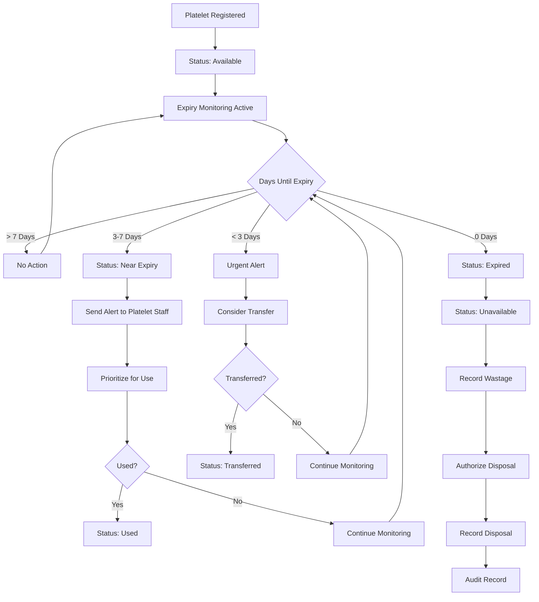

### Expiry Management Steps

1. Platelet product is registered
2. Status is set to "Available"
3. Expiry monitoring is active
4. System checks days until expiry:
   - > 7 days: No action, continue monitoring
   - 3-7 days: Status set to "Near Expiry", alert sent, prioritize for use
   - < 3 days: Urgent alert sent, consider transfer to hospital with immediate need
   - 0 days: Status set to "Expired", then "Unavailable"
5. If expired:
   - Wastage is recorded
   - Disposal is authorized
   - Disposal is recorded
   - Audit record is created

---

## Blood Request Workflow

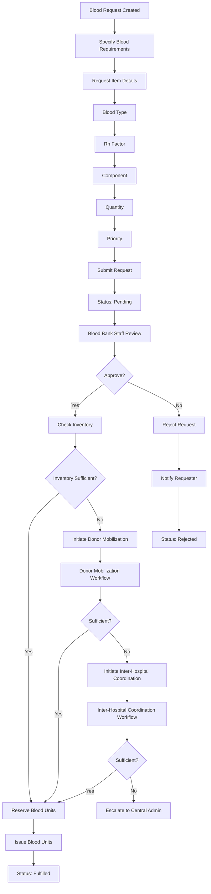

### Request Steps

1. Blood request is created
2. Blood requirements are specified:
   - Blood type
   - Rh factor
   - Component (whole blood, packed cells, plasma, platelets)
   - Quantity
   - Priority
3. Request is submitted
4. Status is set to "Pending"
5. Blood Bank Staff reviews request
6. Staff makes approval decision:
   - Rejected: Requester is notified, status set to "Rejected"
   - Approved: Inventory is checked
7. If inventory is sufficient:
   - Blood units are reserved
   - Blood units are issued
   - Status set to "Fulfilled"
8. If inventory is insufficient:
   - Donor mobilization is initiated
   - If donor mobilization yields sufficient units: reserve and issue
   - If donor mobilization is insufficient: inter-hospital coordination is initiated
   - If inter-hospital coordination yields sufficient units: reserve and issue
   - If still insufficient: escalate to Central Admin

---

## Platelet Request Workflow

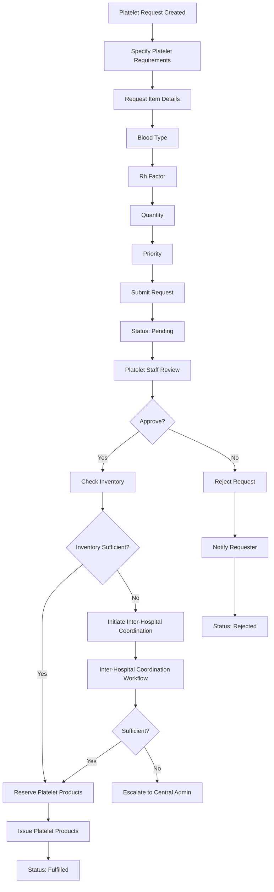

### Request Steps

1. Platelet request is created
2. Platelet requirements are specified:
   - Blood type
   - Rh factor
   - Quantity
   - Priority
3. Request is submitted
4. Status is set to "Pending"
5. Platelet Staff reviews request
6. Staff makes approval decision:
   - Rejected: Requester is notified, status set to "Rejected"
   - Approved: Inventory is checked
7. If inventory is sufficient:
   - Platelet products are reserved
   - Platelet products are issued
   - Status set to "Fulfilled"
8. If inventory is insufficient:
   - Inter-hospital coordination is initiated
   - If coordination yields sufficient products: reserve and issue
   - If still insufficient: escalate to Central Admin

---

## Inter-Hospital Coordination Workflow

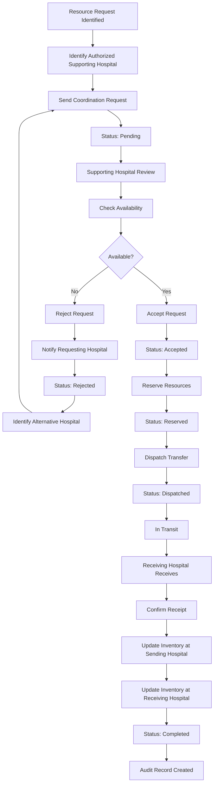

### Coordination Steps

1. Resource request is identified (blood or platelet)
2. System identifies authorized supporting hospital within institution
3. Coordination request is sent to supporting hospital
4. Status is set to "Pending"
5. Supporting hospital reviews request
6. Supporting hospital checks availability
7. Supporting hospital makes decision:
   - Not available: Request is rejected, requesting hospital is notified, alternative hospital is identified
   - Available: Request is accepted
8. If accepted:
   - Resources are reserved at supporting hospital
   - Status set to "Reserved"
   - Resources are dispatched
   - Status set to "Dispatched"
   - Transfer is in transit
   - Receiving hospital receives resources
   - Receipt is confirmed
   - Inventory is updated at both hospitals
   - Status set to "Completed"
   - Audit record is created

---

## Reservation Workflow

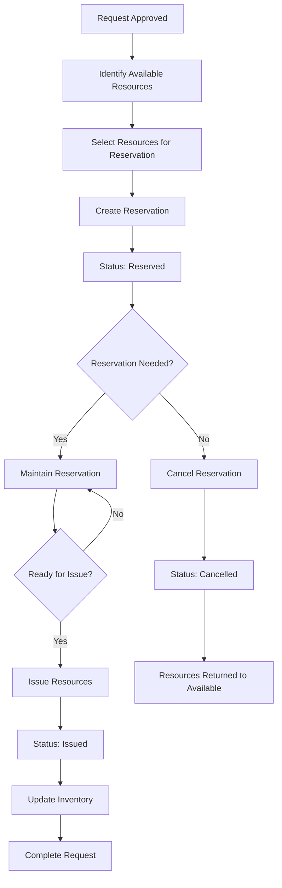

### Reservation Steps

1. Request is approved
2. Available resources are identified
3. Resources are selected for reservation
4. Reservation is created
5. Status is set to "Reserved"
6. System checks if reservation is still needed:
   - Yes: Reservation is maintained until ready for issue
   - No: Reservation is cancelled, resources returned to available
7. When ready for issue:
   - Resources are issued
   - Status set to "Issued"
   - Inventory is updated
   - Request is completed

---

## Transfer Workflow

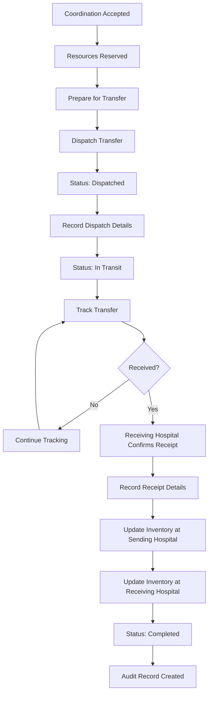

### Transfer Steps

1. Coordination request is accepted
2. Resources are reserved at sending hospital
3. Transfer is prepared
4. Transfer is dispatched
5. Status set to "Dispatched"
6. Dispatch details are recorded
7. Status set to "In Transit"
8. Transfer is tracked
9. Receiving hospital confirms receipt
10. Receipt details are recorded
11. Inventory is updated at sending hospital
12. Inventory is updated at receiving hospital
13. Status set to "Completed"
14. Audit record is created

---

## Receipt Workflow

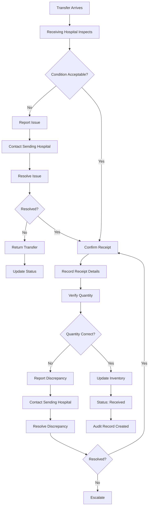

### Receipt Steps

1. Transfer arrives at receiving hospital
2. Receiving hospital inspects transfer
3. Condition is verified:
   - Not acceptable: Issue is reported, sending hospital is contacted, issue is resolved or transfer is returned
   - Acceptable: Receipt is confirmed
4. Receipt details are recorded
5. Quantity is verified:
   - Incorrect: Discrepancy is reported, sending hospital is contacted, discrepancy is resolved or escalated
   - Correct: Inventory is updated
6. Status is set to "Received"
7. Audit record is created

---

## Audit Workflow

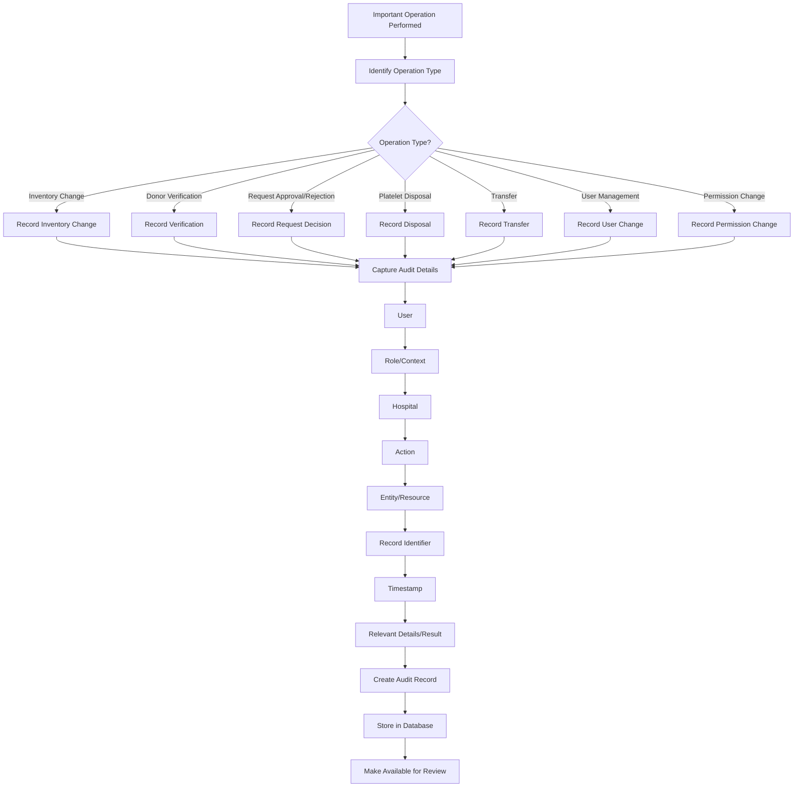

### Audit Steps

1. Important operation is performed
2. System identifies operation type:
   - Inventory change
   - Donor verification
   - Request approval/rejection
   - Platelet disposal
   - Transfer
   - User management
   - Permission change
3. System captures audit details:
   - User who performed action
   - Role/context of user
   - Hospital where action was performed
   - Action performed
   - Entity/resource affected
   - Record identifier
   - Timestamp of action
   - Relevant details/result
4. Audit record is created
5. Audit record is stored in database
6. Audit record is made available for review

---

## Workflow Integration

### Cross-Module Workflow Dependencies

```
Blood Request Workflow
    ↓ (if insufficient inventory)
Donor Mobilization Workflow
    ↓ (if still insufficient)
Inter-Hospital Coordination Workflow
    ↓
Reservation Workflow
    ↓
Transfer Workflow
    ↓
Receipt Workflow
    ↓
Audit Workflow
```

### Platelet Workflow Integration

```
Platelet Request Workflow
    ↓ (if insufficient inventory)
Inter-Hospital Coordination Workflow
    ↓
Reservation Workflow
    ↓
Transfer Workflow
    ↓
Receipt Workflow
    ↓
Audit Workflow
```

### Expiry Monitoring Integration

```
Platelet Lifecycle Workflow
    ↓ (continuous)
Expiry Management Workflow
    ↓ (if expired)
Wastage/Disposal Workflow
    ↓
Audit Workflow
```

---

## Related Documentation

- [Project Specification](PROJECT_SPECIFICATION.md)
- [Architecture](ARCHITECTURE.md)
- [Module Roadmap](MODULE_ROADMAP.md)
- [User Roles and Permissions](USER_ROLES_AND_PERMISSIONS.md)
- [Database Design Principles](DATABASE_DESIGN_PRINCIPLES.md)
- [Security and Access Rules](SECURITY_AND_ACCESS_RULES.md)
